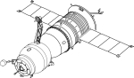

# Remote sensing and biodiversity: a love story?

## Context

Airborne observation of Earth and satellite systems is one of the emerging technologies for biodiversity monitoring.

Kissling et al 2018, "Building essential biodiversity variables (EBVs) of species distribution and abundance at a global scale", https://doi.org/10.1111/brv.12359

It allows the production of maps for spatially explicit modeling and monitoring, at local to global scales.

Therefore, it's necessary to strengthen the dialogue and collaboration between the biodiversity monitoring and the remote sensing community so that satellite remote sensing (SRS) becomes a usefull tool for conservation. Increased dialogue is also essential within the biodiversity monitoring community to achieve this. Agreement on what is most urgently needed, given the range of possibilities, is crucial for developing SRS-based products that can be used by policymakers and international conventions.

SRS offers an opportunity to expand the range of data that can support biodiversity monitoring efforts worldwide. It provides global coverage and enables the collection of multiple spatial and temporal data.

## Usefulness

These dialogues between different scientific communities ( biodiversity and SRS) and within a single community must be supported by open source software solutions. These freely available data and software are of vital importance in facilitating the development of methodologies that are accessible to all, regardless of financial means.
The combination of freely accessible data and open source softwares allows for the production of standardized and transparent products, improving the chances of preserving these datasets in the long term and being able to reuse them.

# A full workflow for Sentinel 2 data on Galaxy

This workflow goes from the pre-processing of Sentinel 2 data to the production of biodiversity indicators.

Once the pre processing of the data made this workflow has 3 main steps.

## Global study

The R package Rasterdiv used in one of the [tool]() provides an unprecedented suite of functions for calculating various indices to estimate diversity from space-based information and perform a first exploration of potential biodiversity hotspots worldwide with one glance. 

## Canopy study

Optical remote sensing has shown great potential for estimating several components of biodiversity, even for highly complex ecosystems such as tropical forests. Operational methods should require minimal supervision and not rely on extensive ground data collection. These techniques ensure applicability even in remote locations without ground access in tropical environments.

M. Féret has developed a method that meets these requirements and has validated its performance for mapping tropical forest diversity from high spatial resolution airborne imaging spectroscopy. The [BiodivMapR](https://jbferet.github.io/biodivMapR/index.html) R package is an adaptation of the method proposed by M. Féret to process Sentinel-2 data, and aims to provide operational [tools]() to ecologists and remote sensing communities to accelerate and facilitate their ability to evaluate existing techniques based on abundant remote sensing data.

## Well being study

In addition to these various basic indicators in ecology, spectral indices specific to remote sensing data are added. Spectral indices are used to highlight particular characteristics or properties of the Earth's surface, such as vegetation, soil, and water. They are developed based on the spectral properties of the object of interest.
Knowledge of the leaf cell, plant structure, its state, condition, and spectral properties is essential for analyzing vegetation using remote sensing data. The [tool]() based on spectral indices allows to assess the well being of the area observed.

# Don't put all your eggs in one basket

Diversity measurements made on spatial data should not replace in situ biological diversity data, but rather complement existing data and approaches. Spatial diversity estimates are currently based on long periods, allowing for more **general** predictions on the speeds of changes in ecosystem variations.

       

